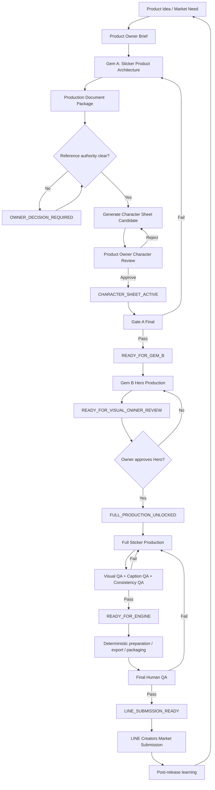

# LINE Sticker End-to-End Production Pipeline

**Version:** 1.0  
**Status:** Active  
**Owner:** Product Owner / MTLineSticker  
**Applies to:** All sticker sets unless a set-specific SSOT overrides a rule.

## 1. Purpose

This document defines the canonical production flow from product idea to a release-ready LINE sticker set. It is designed for a mixed human + AI workflow using Gem A for product architecture, an image-generation AI for Character Sheet and visual candidates, Gem B for controlled visual production, repository documents as SSOT, and deterministic downstream tooling for packaging/validation when available.

The workflow optimizes for five outcomes:

1. real-chat usefulness,
2. commercial differentiation,
3. Character consistency,
4. production reliability,
5. controlled release quality.

Completing 40 images is not success by itself. The product must survive the gates below.

---

## 2. Canonical pipeline



---

## 3. Stage 0 — Product opportunity and brief

### Goal
Define what product is being built and why someone would use or buy it.

### Minimum inputs
- Product concept
- Target audience
- Intended chat use
- Character concept or references
- Caption list, seed captions, or desired communication territory
- Any owner-locked constraints

### Recommended product questions
- Who is the buyer/user?
- What repeated chat jobs does this set solve?
- What makes the set different from generic stickers?
- Which frames create purchase appeal?
- Which frames create repeat-use value?
- What emotional range is needed?

### Output
A concise Product Owner brief. The user does not need to describe internal manifests, gates, QA schemas or package file names.

---

## 4. Stage 1 — Gem A: Sticker Product Architecture

### Role
Gem A is the **Sticker Product Architect**, not the final artwork generator.

### Inputs
- Product Owner brief
- Current reference images/video/text
- Locked or seed captions
- Existing approved Character/Style SSOT if any
- Fixed Gem A knowledge pack

### Gem A responsibilities
Gem A must convert a concise request into a complete Production Document Package containing product strategy, Character rules, communication architecture, visual-production planning, QA and handoff state.

### Required package structure

```text
00_PACKAGE/
  README.md
  PACKAGE_MANIFEST.md
  HANDOFF_STATUS.md

01_PRODUCT/
  PRODUCT_BRIEF.md
  TARGET_AUDIENCE_JTBD.md
  PRODUCT_POSITIONING.md
  COMMERCIAL_SCORECARD.md

02_CHARACTER/
  CHARACTER_BIBLE.md
  CHARACTER_SHEET_SPECIFICATION.md
  CHARACTER_SHEET_GENERATION_PROMPT.md
  CHARACTER_SHEET_NEGATIVE_CONSTRAINTS.md
  CHARACTER_SHEET_APPROVAL_CHECKLIST.md

03_COMMUNICATION/
  CAPTION_ARCHITECTURE.md
  CAPTION_MASTER.md
  FRAME_COMMUNICATION_MATRIX.md

04_VISUAL_PRODUCTION/
  HERO_PLAN.md
  MASTER_SHEET_PLAN.md
  VISUAL_DIRECTION.md
  FRAME_TO_SHEET_MAPPING.md

05_QA/
  QA_RULES.md
  AUTO_REJECT_RULES.md
  GATE_A_CHECKLIST.md
  PRE_PACKAGE_SELF_AUDIT.md

06_HANDOFF/
  GEM_B_INPUT_MANIFEST.md
  HANDOFF_MANIFEST.md
  OPEN_ITEMS_AND_OWNER_DECISIONS.md
```

### Core validation
For a 40-frame set:
- CAPTION_MASTER = 40 explicit Frame IDs
- FRAME_COMMUNICATION_MATRIX = 40 populated entries
- FRAME_TO_SHEET_MAPPING = 40 explicit mappings
- missing = 0
- duplicate = 0
- cross-file mismatch = 0

### Commercial validation
Gem A must evaluate:
- audience clarity,
- repeat-use score per caption,
- portfolio balance,
- differentiation,
- signature territory,
- purchase hooks,
- redundancy risk,
- emotional range,
- Character-market fit,
- commercial risks.

### Reference conflict rule
If Product Owner says there are 5 references but 6 are observed, Gem A must not choose which is supplemental or authoritative. It records `REFERENCE_COUNT_CONFLICT` and requires Product Owner resolution.

### Exit states
- `DRAFT`
- `INTERNAL_QA`
- `OWNER_DECISION_REQUIRED`
- `SSOT_CONFLICT`
- `BLOCKED`
- `READY_FOR_GEM_B` only after Character Sheet approval and Gate A pass

Normally the initial Gem A package before Character Sheet approval is `OWNER_DECISION_REQUIRED`.

---

## 5. Stage 2 — Character Sheet Candidate

### Goal
Create the visual Character SSOT candidate before producing Hero or full stickers.

### Inputs to image-generation AI
Send:
- the complete `02_CHARACTER/` folder,
- the exact approved reference images,
- optionally package-level open-item information if a relevant conflict exists.

### Primary authority inside `02_CHARACTER/`
1. `CHARACTER_BIBLE.md`
2. `CHARACTER_SHEET_SPECIFICATION.md`
3. `CHARACTER_SHEET_GENERATION_PROMPT.md`
4. `CHARACTER_SHEET_NEGATIVE_CONSTRAINTS.md`
5. `CHARACTER_SHEET_APPROVAL_CHECKLIST.md`

### What the Character Sheet must test
- Front view
- 3/4 view
- Side view
- Rear or rear 3/4
- Face/hair close-up
- Full-body proportions
- Expression range
- Pose/action range
- Wardrobe states
- Mandatory versus optional accessories
- Cross-view identity consistency

### Identity-fidelity criteria
When person references exist, evaluate visible evidence such as:
- face silhouette,
- brow/eye placement,
- nose/mouth proportion,
- jaw/chin silhouette,
- hairline geometry,
- haircut boundaries,
- head/body proportion,
- shoulder/torso proportion,
- other visible distinctive features.

Do not infer exact age, ethnicity, nationality, profession, rank or other unsupported identity claims.

### Candidate state
The image AI may emit `READY_FOR_CHARACTER_OWNER_REVIEW`.
It may **not** self-approve `CHARACTER_SHEET_ACTIVE`.

---

## 6. Stage 3 — Product Owner Character approval

### Product Owner checks
- Is this clearly the intended Character?
- Are all canonical views the same person/Character?
- Is hairline/haircut consistent?
- Are body proportions stable?
- Are wardrobe and mandatory accessories correct?
- Are optional accessories represented correctly rather than forced everywhere?
- Are owner-locked traits preserved?
- Is forbidden visual drift absent?
- Is the style suitable for small sticker viewing?

### Reject conditions
Reject if:
- identity changes between views,
- owner locks are violated,
- unsupported traits are introduced,
- mandatory accessory placement is wrong,
- optional elements are silently made permanent,
- body/hair/face continuity is materially inconsistent.

### Approval artifact
On explicit Product Owner approval, record:

`CHARACTER_SHEET_ACTIVE`

Recommended identifier pattern:

`CHAR-SSOT-001 v1.0 — CHARACTER_SHEET_ACTIVE`

Once active, this visual sheet becomes the Character Visual SSOT for downstream production unless replaced by a later approved version.

---

## 7. Stage 4 — Gate A final and Gem B handoff

### Required inputs
- Production Document Package
- `CHARACTER_SHEET_ACTIVE`
- approved reference images when required for fidelity checking
- resolved reference authority

### Gate A passes only when
- package structure complete,
- product intent coherent,
- captions/frame intents controlled,
- commercial scorecard complete,
- Character/Style requirements explicit,
- Character Sheet active,
- Hero plan complete,
- mapping complete,
- QA rules explicit,
- no blocking open item remains.

### Exit state
`READY_FOR_GEM_B`

---

## 8. Stage 5 — Gem B Hero production

### Purpose
Test the Character and visual system on a small representative set before spending effort on all 40 frames.

### Inputs
- Production Document Package
- `CHARACTER_SHEET_ACTIVE`
- current approved references if needed

### Gem B must read
- `HERO_PLAN.md`
- Hero entries in `FRAME_COMMUNICATION_MATRIX.md`
- `VISUAL_DIRECTION.md`
- Character SSOT
- QA rules
- Auto-reject rules

### Hero selection principles
Hero frames should jointly test:
- high-frequency utility,
- commercial differentiation,
- Character memorability,
- warmth/emotion,
- humor when relevant,
- difficult poses/props,
- continuity risks,
- purchase appeal.

### Gem B may not
- rewrite locked captions,
- invent Character facts,
- produce all 40 before Hero approval,
- promote optional accessories to mandatory,
- change Character identity for convenience.

### Exit state
`READY_FOR_VISUAL_OWNER_REVIEW`

---

## 9. Stage 6 — Hero owner review

The Product Owner reviews Hero output for:
- Character fidelity,
- caption correctness,
- 1-second communication clarity,
- expression/pose fit,
- visual hierarchy,
- small-size readability,
- consistency across Heroes,
- concept differentiation,
- purchase appeal.

If rejected, revise only the necessary Hero frames or Character SSOT if the defect is systemic.

If approved, emit:

`FULL_PRODUCTION_UNLOCKED`

---

## 10. Stage 7 — Full production

### Standard 40-frame production
Default working model:
- 4 sheets × 10 stickers,
- explicit Frame IDs,
- controlled mapping,
- consistent master size and safe area,
- transparent background where required by the set specification.

### Each sticker must preserve
- exact caption,
- intended chat meaning,
- Character SSOT,
- visual style,
- mandatory accessories,
- contextual accessories only when justified,
- readable silhouette,
- no frame bleed.

### Production strategy
Prefer controlled batches rather than generating 40 uncontrolled frames at once. After each batch, perform QA before continuing.

---

## 11. Stage 8 — Visual and content QA

### Content QA
- exact caption text
- correct Thai spelling
- correct punctuation
- correct Frame ID
- no missing/duplicate frame

### Character QA
- same identity
- hair continuity
- face continuity
- body proportion continuity
- wardrobe/accessory continuity

### Communication QA
- one primary intent per frame
- understandable in approximately one second
- pose/expression supports caption
- props help rather than distract

### Technical QA
- expected dimensions
- transparency/background rule
- padding/safe area
- no clipping
- no cross-frame bleed
- sufficient resolution for downstream resizing

### Commercial QA
- signature frames remain visually distinctive
- utility frames remain easy to use
- visual set is not monotonous
- purchase hooks are represented strongly

### Exit state
`READY_FOR_ENGINE`

---

## 12. Stage 9 — Engine / deterministic preparation

The deterministic tooling layer owns operations that should not depend on generative judgment, for example:
- cropping/slicing,
- resizing,
- format conversion,
- alpha/transparency checks,
- naming,
- package structure,
- automated validations,
- export preparation.

Gem A and Gem B must not silently redefine deterministic production rules that belong to the engine/standards layer.

If automated tooling reports defects, fix the source asset where appropriate instead of masking a visual defect during export.

---

## 13. Stage 10 — Final Human QA

Final review should be performed on the actual export candidates, not only the production masters.

Check:
- all required stickers present,
- captions correct,
- transparency correct,
- no cropping defect,
- no unreadable small text,
- Character consistent,
- main/tab assets correct if required,
- naming/metadata complete,
- no accidental draft/candidate asset included.

Exit state:

`LINE_SUBMISSION_READY`

---

## 14. Stage 11 — LINE Creators Market submission

Before submission, confirm current LINE Creators Market requirements from the authoritative LINE documentation because platform requirements may change.

Submission package normally includes the required sticker images and associated metadata such as title/description and set assets according to the current platform specification.

Do not hard-code a historical external platform rule into permanent project truth without version/date/source.

---

## 15. Stage 12 — Post-release commercial learning

The workflow does not end at submission.

Capture where available:
- sales trend,
- usage/feedback signals,
- strongest captions,
- weak/unmemorable captions,
- comments from users,
- visual defects discovered after release,
- opportunities for Set 2 or derivative products.

Feed evidence back into:
- caption architecture,
- portfolio calibration,
- Character strategy,
- Hero selection,
- product positioning.

Do not claim guaranteed sales from pre-release scoring. Commercial scorecards are decision aids; real market performance is the learning loop.

---

## 16. State machine summary

```text
DRAFT
→ INTERNAL_QA
→ OWNER_DECISION_REQUIRED (when needed)
→ READY_FOR_CHARACTER_OWNER_REVIEW
→ CHARACTER_SHEET_ACTIVE
→ READY_FOR_GEM_B
→ READY_FOR_VISUAL_OWNER_REVIEW
→ FULL_PRODUCTION_UNLOCKED
→ READY_FOR_ENGINE
→ LINE_SUBMISSION_READY
```

Possible interruption states:

```text
SSOT_CONFLICT
REFERENCE_COUNT_CONFLICT
BLOCKED
REJECT / REVISION_REQUIRED
```

No AI may skip a Product Owner-controlled approval merely because it has enough information to continue.

---

## 17. Golden operating rules

1. Repository SSOT beats model memory.
2. Current-task evidence beats stale conversation context.
3. Locked owner requirements beat conflicting visual reference details.
4. Unknown non-blocking facts remain `UNSPECIFIED`.
5. Do not generate 40 before Character and Hero gates pass.
6. A prose PASS is not evidence; counts and artifacts must reconcile.
7. Visual candidate is not automatically approved SSOT.
8. Commercial usefulness and differentiation must both be protected.
9. Fix defects at the earliest owning stage.
10. Human approval remains mandatory at Character, Hero and final release gates.
